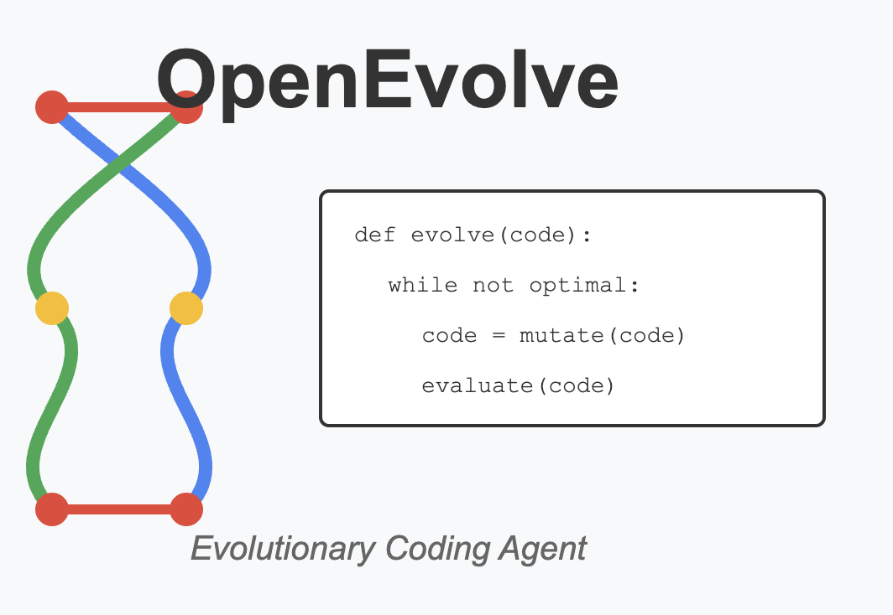
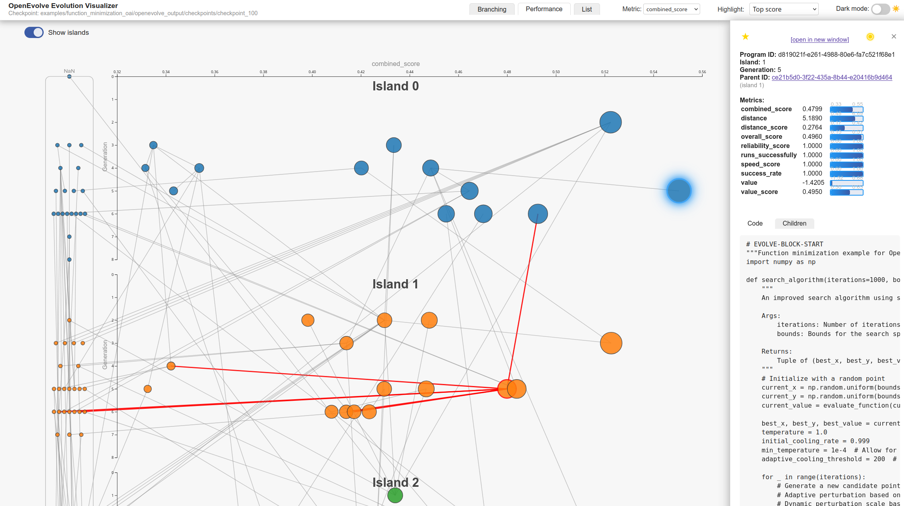

# OpenEvolve

An open-source implementation of the AlphaEvolve system described in the Google DeepMind paper "AlphaEvolve: A coding agent for scientific and algorithmic discovery" (2025).



## Overview

OpenEvolve is an evolutionary coding agent that uses Large Language Models to optimize code through an iterative process. It orchestrates a pipeline of LLM-based code generation, evaluation, and selection to continuously improve programs for a variety of tasks.

Key features:
- Evolution of entire code files, not just single functions
- Support for multiple programming languages
- Supports OpenAI-compatible APIs for any LLM
- Multi-objective optimization
- Flexible prompt engineering
- Distributed evaluation

## How It Works

OpenEvolve follows an evolutionary approach with the following components:


### Prompt Sampler
The **Prompt Sampler** is responsible for creating highly informative and context-rich prompts that are fed to the LLM Ensemble. These prompts are carefully constructed to guide the language models effectively. They typically include:
*   **Past Programs**: Snippets or entire versions of code from previous iterations, especially successful or interesting ones.
*   **Performance Metrics**: Scores and other evaluation data from past programs, indicating what worked well and what didn't.
*   **Problem Description**: The original problem statement or requirements the code is intended to solve.
*   **Evolution History**: Information about the lineage of programs, helping the LLM understand the trajectory of changes.
*   **Diversity Considerations**: Elements to encourage exploration of different solution approaches, preventing premature convergence.
By providing such comprehensive context, the Prompt Sampler enables the LLMs to make more informed and targeted code modifications.

### LLM Ensemble
Instead of relying on a single language model, OpenEvolve utilizes an **LLM Ensemble**, which is a group of diverse language models. This approach offers several advantages:
*   **Diversity in Models**: The ensemble can include LLMs with different architectures, sizes, or fine-tuning on specific coding tasks, leading to a broader range of generated code.
*   **Combined or Selected Outputs**: The outputs from different LLMs can be combined (e.g., through a voting mechanism if applicable) or selectively chosen based on certain criteria or heuristics.
*   **Specialized Roles**: Different LLMs within the ensemble might be specialized for particular types of code modifications (e.g., one for creative exploration, another for fine-grained optimization).
The LLM Ensemble generates various code modifications, such as:
*   **Targeted Mutations**: Small changes to existing code.
*   **Adding New Code**: Introducing new functions, classes, or modules.
*   **Refactoring**: Restructuring existing code for clarity, efficiency, or maintainability.
*   **Algorithmic Exploration**: Attempting entirely new approaches to solve the problem.

### Evaluator Pool
The **Evaluator Pool** is where the newly generated program variants are rigorously tested and assessed. This component manages:
*   **Isolated Execution Environments**: Each program is typically run in a sandbox or container to prevent interference and ensure consistent testing conditions.
*   **Standardized Test Harnesses**: Common frameworks or scripts might be used to automate the execution of tests.
*   **User-Defined Test Cases and Benchmarks**: The actual tests and performance benchmarks are specific to the problem being solved and are provided by the user.
*   **Metrics Measurement**: A variety of metrics can be measured, including:
    *   **Correctness**: Whether the program produces the desired output or behaves as expected.
    *   **Performance**: Execution speed, efficiency, or throughput.
    *   **Resource Usage**: Memory consumption, CPU load, etc.
    *   **Custom Objectives**: Any other problem-specific criteria.
The scores and metrics assigned by the Evaluator Pool are crucial for the selection process, determining which programs are promising and should be used to seed future generations.

### Program Database
The **Program Database** serves as the central repository for all information generated and collected during the evolutionary process. It stores:
*   **Source Code**: The complete source code of every program variant generated.
*   **Ancestry/Lineage**: Information about which parent programs a new variant was derived from.
*   **Detailed Evaluation Results**: All metrics and scores from the Evaluator Pool for each program.
*   **Timestamps**: When programs were generated and evaluated, allowing for chronological tracking.
*   **Errors and Exceptions**: Any issues encountered during execution or evaluation.
This rich dataset is vital for guiding the evolution. It informs selection strategies (e.g., Pareto optimization for tasks with multiple conflicting objectives), helps maintain population diversity by identifying unique solutions, tracks overall progress, and enables the resumption of long-running evolutionary processes from checkpoints.

### Controller
The **Controller** is the brain of the OpenEvolve system, orchestrating the entire evolutionary workflow. Its key responsibilities include:
*   **Workflow Management**: It manages the sequence of operations, ensuring that prompts are generated, LLMs are invoked, programs are evaluated, and results are stored in the database in the correct order.
*   **Asynchronous Pipeline**: The Controller often implements an asynchronous pipeline to maximize throughput. This means that different components can work in parallel (e.g., evaluating one set of programs while another set is being generated), significantly speeding up the evolution.
*   **Inter-Component Communication**: It handles the data flow and communication between the Prompt Sampler, LLM Ensemble, Evaluator Pool, and Program Database.
*   **Task Queues**: It manages queues of tasks for each component (e.g., programs awaiting evaluation).
*   **Resource Utilization**: It aims to ensure efficient use of computational resources, such as distributing evaluation tasks across available workers in the Evaluator Pool.

## Getting Started

### Installation

To install natively, use:
```bash
git clone https://github.com/codelion/openevolve.git
cd openevolve
pip install -e .
```

### Quick Start

We use the OpenAI SDK, so you can use any LLM or provider that supports an OpenAI compatible API. Just set the `OPENAI_API_KEY` environment variable
and update the `api_base` in config.yaml if you are using a provider other than OpenAI. For local models, you can use
an inference server like [optillm](https://github.com/codelion/optillm).

```python
from openevolve import OpenEvolve

# Initialize the system
evolve = OpenEvolve(
    initial_program_path="path/to/initial_program.py",
    evaluation_file="path/to/evaluator.py",
    config_path="path/to/config.yaml"
)

# Run the evolution
best_program = await evolve.run(iterations=1000)
print(f"Best program metrics:")
for name, value in best_program.metrics.items():
    print(f"  {name}: {value:.4f}")
```

### Command-Line Usage

OpenEvolve can also be run from the command line:

```bash
python openevolve-run.py path/to/initial_program.py path/to/evaluator.py --config path/to/config.yaml --iterations 1000
```

### Resuming from Checkpoints

OpenEvolve automatically saves checkpoints at intervals specified by the `checkpoint_interval` config parameter (default is 10 iterations). You can resume an evolution run from a saved checkpoint:

```bash
python openevolve-run.py path/to/initial_program.py path/to/evaluator.py \
  --config path/to/config.yaml \
  --checkpoint path/to/checkpoint_directory \
  --iterations 50
```

When resuming from a checkpoint:
- The system loads all previously evolved programs and their metrics
- Checkpoint numbering continues from where it left off (e.g., if loaded from checkpoint_50, the next checkpoint will be checkpoint_60)
- All evolution state is preserved (best programs, feature maps, archives, etc.)
- Each checkpoint directory contains a copy of the best program at that point in time

Example workflow with checkpoints:

```bash
# Run for 50 iterations (creates checkpoints at iterations 10, 20, 30, 40, 50)
python openevolve-run.py examples/function_minimization/initial_program.py \
  examples/function_minimization/evaluator.py \
  --iterations 50

# Resume from checkpoint 50 for another 50 iterations (creates checkpoints at 60, 70, 80, 90, 100)
python openevolve-run.py examples/function_minimization/initial_program.py \
  examples/function_minimization/evaluator.py \
  --checkpoint examples/function_minimization/openevolve_output/checkpoints/checkpoint_50 \
  --iterations 50
```

### Comparing Results Across Checkpoints

Each checkpoint directory contains the best program found up to that point, making it easy to compare solutions over time:

```
checkpoints/
  checkpoint_10/
    best_program.py         # Best program at iteration 10
    best_program_info.json  # Metrics and details
    programs/               # All programs evaluated so far
    metadata.json           # Database state
  checkpoint_20/
    best_program.py         # Best program at iteration 20
    ...
```

You can compare the evolution of solutions by examining the best programs at different checkpoints:

```bash
# Compare best programs at different checkpoints
diff -u checkpoints/checkpoint_10/best_program.py checkpoints/checkpoint_20/best_program.py

# Compare metrics
cat checkpoints/checkpoint_*/best_program_info.json | grep -A 10 metrics
```

### Visualizing the evolution tree

The script in `scripts/visualize.py` allows you to visualize the evolution tree and display it in your webbrowser. The script watches live for the newest checkpoint directory in the examples/ folder structure and updates the graph. Alternatively, you can also provide a specific checkpoint folder with the `--path` parameter.

```bash
# Install requirements
pip install -r scripts/requirements.txt

# Start the visualization web server and have it watch the examples/ folder
python scripts/visualizer.py

# Start the visualization web server with a specific checkpoint
python scripts/visualizer.py --path examples/function_minimization/openevolve_output/checkpoints/checkpoint_100/
```

In the visualization UI, you can
- see the branching of your program evolution in a network visualization, with node radius chosen by the program fitness (= the currently selected metric),
- see the parent-child relationship of nodes and click through them in the sidebar (use the yellow locator icon in the sidebar to center the node in the graph),
- select the metric of interest (with the available metric choices depending on your data set),
- highlight nodes, for example the top score (for the chosen metric) or the MAP-elites members,
- click nodes to see their code and prompts (if available from the checkpoint data) in a sidebar,
- in the "Performance" tab, see their selected metric score vs generation in a graph



### Docker

You can also install and execute via Docker:
```bash
docker build -t openevolve .
docker run --rm -v $(pwd):/app --network="host" openevolve examples/function_minimization/initial_program.py examples/function_minimization/evaluator.py --config examples/function_minimization/config.yaml --iterations 1000
```

## Configuration

OpenEvolve is highly configurable. You can specify configuration options in a YAML file:

```yaml
# Example configuration
max_iterations: 1000
llm:
  primary_model: "gemini-2.0-flash-lite"
  secondary_model: "gemini-2.0-flash"
  temperature: 0.7
database:
  population_size: 500
  num_islands: 5
```

Sample configuration files are available in the `configs/` directory:
- `default_config.yaml`: Comprehensive configuration with all available options

See the [Configuration Guide](configs/default_config.yaml) for a full list of options.

## Artifacts Channel

OpenEvolve includes an **artifacts side-channel** that allows evaluators to capture build errors, profiling results, etc. to provide better feedback to the LLM in subsequent generations. This feature enhances the evolution process by giving the LLM context about what went wrong and how to fix it.

The artifacts channel operates alongside the traditional fitness metrics.

### Example: Compilation Failure Feedback

```python
from openevolve.evaluation_result import EvaluationResult

return EvaluationResult(
    metrics={"compile_ok": 0.0, "score": 0.0},
    artifacts={
        "stderr": "SyntaxError: invalid syntax (line 15)",
        "traceback": "...",
        "failure_stage": "compilation"
    }
)
```

The next generation prompt will include:
```markdown
## Last Execution Output
### Stderr
SyntaxError: invalid syntax (line 15)

### Traceback
...
```

## Example: LLM Feedback

An example for an LLM artifact side channel is part of the default evaluation template, which ends with
```markdown
Return your evaluation as a JSON object with the following format:
{{
    "readability": [score],
    "maintainability": [score],
    "efficiency": [score],
    "reasoning": "[brief explanation of scores]"
}}
```
The non-float values, in this case the "reasoning" key of the json response that the evaluator LLM generates, will be available within the next generation prompt.

### Configuration

Artifacts can be controlled via configuration and environment variables:

```yaml
# config.yaml
evaluator:
  enable_artifacts: true

prompt:
  include_artifacts: true
  max_artifact_bytes: 4096  # 4KB limit in prompts
  artifact_security_filter: true
```

```bash
# Environment variable to disable artifacts
export ENABLE_ARTIFACTS=false
```

### Benefits

- **Faster convergence** - LLMs can see what went wrong and fix it directly
- **Better error handling** - Compilation and runtime failures become learning opportunities
- **Rich debugging context** - Full stack traces and error messages guide improvements
- **Zero overhead** - When disabled, no performance impact on evaluation

## Examples

See the `examples/` directory for complete examples of using OpenEvolve on various problems:

### Symbolic Regression

A comprehensive example demonstrating OpenEvolve's application to symbolic regression tasks using the LLM-SRBench benchmark. This example shows how OpenEvolve can evolve simple mathematical expressions (like linear models) into complex symbolic formulas that accurately fit scientific datasets.

[Explore the Symbolic Regression Example](examples/symbolic_regression/)

Key features:
- Automatic generation of initial programs from benchmark tasks
- Evolution from simple linear models to complex mathematical expressions
- Evaluation on physics, chemistry, biology, and material science datasets
- Competitive results compared to state-of-the-art symbolic regression methods

### Circle Packing

Our implementation of the circle packing problem from the AlphaEvolve paper. For the n=26 case, where one needs to pack 26 circles in a unit square we also obtain SOTA results.

[Explore the Circle Packing Example](examples/circle_packing/)

We have sucessfully replicated the results from the AlphaEvolve paper, below is the packing found by OpenEvolve after 800 iterations


This is exactly the packing reported by AlphaEvolve in their paper (Figure 14):


### Function Minimization

An example showing how OpenEvolve can transform a simple random search algorithm into a sophisticated simulated annealing approach.

[Explore the Function Minimization Example](examples/function_minimization/)

## Preparing Your Own Problems

To use OpenEvolve for your own problems:

1. **Mark code sections** to evolve with `# EVOLVE-BLOCK-START` and `# EVOLVE-BLOCK-END` comments
2. **Create an evaluation function** that returns a dictionary of metrics
3. **Configure OpenEvolve** with appropriate parameters
4. **Run the evolution** process

## Citation

If you use OpenEvolve in your research, please cite:

```
@software{openevolve,
  title = {OpenEvolve: Open-source implementation of AlphaEvolve},
  author = {Asankhaya Sharma},
  year = {2025},
  publisher = {GitHub},
  url = {https://github.com/codelion/openevolve}
}
```
